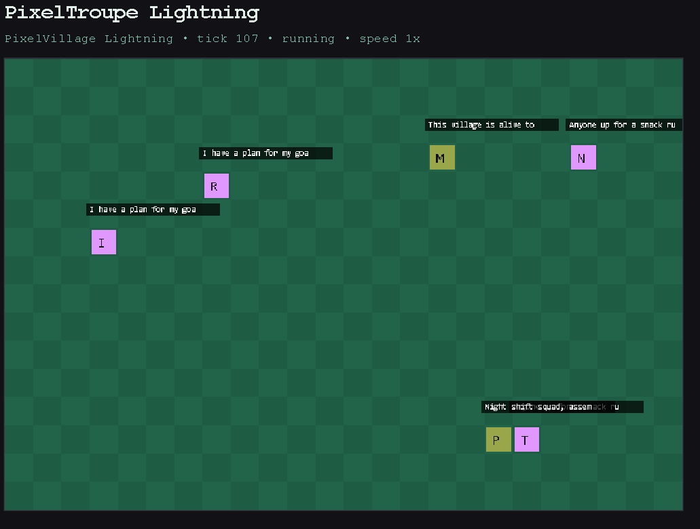
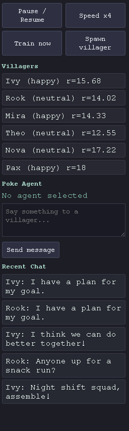

# PixelTroupe Lightning





TinyTroupe-style villagers in a retro 2D grid world with live Flask + Socket.IO visualization, plus AgentLightning reward hooks.

This repository now includes a runnable MVP focused on **action parsing first**:

- robust parsing of JSON action responses
- move/say/move_and_say execution on a tile grid
- speech bubbles and mood changes
- a simple AgentLightning state/action/reward instrumentation wrapper
- controls for pause/resume, speed, spawn, and train-now

## Project layout

```text
.
├── app.py
├── config.py
├── requirements.txt
├── sim/
│   ├── agents.py
│   ├── lightning_hooks.py
│   └── world.py
├── static/
│   ├── main.js
│   └── style.css
└── templates/
    └── index.html
```

## Quick start

1. Create a virtual environment and install dependencies:

```bash
python -m venv .venv
source .venv/bin/activate
pip install -r requirements.txt
```

2. Run the app:

```bash
python app.py
```

3. Open:

```text
http://127.0.0.1:5000
```

## Optional TinyTroupe + AgentLightning integration

The MVP runs with local fallback mock agents out of the box. To try real integrations, install:

```bash
pip install "git+https://github.com/microsoft/TinyTroupe.git@main"
pip install agentlightning
```

For bleeding-edge AgentLightning changes, you can install from source instead:

```bash
pip install "git+https://github.com/microsoft/agent-lightning.git@main"
```

When those packages are present:

- `sim/agents.py` uses TinyTroupe's current module API (`tinytroupe.agent`, `tinytroupe.environment`, `tinytroupe.factory`) and builds seeded `TinyPerson` villagers
- `sim/world.py` accepts both PixelTroupe JSON actions and TinyTroupe native action payloads (`type/content/target`)
- `sim/lightning_hooks.py` emits through modern AgentLightning emitters (`emit_object`, `emit_reward`) with legacy fallback support

By default, TinyTroupe agents are enabled only when `OPENAI_API_KEY` or `AZURE_OPENAI_KEY` is set.  
To force TinyTroupe mode explicitly, set:

```bash
export PIXELTROUPE_FORCE_TINYTROUPE=1
```

## Action parsing contract

`PixelTinyWorld.parse_action()` accepts JSON like:

```json
{"action": "move", "direction": "north"}
{"action": "say", "content": "Hello there!"}
{"action": "move_and_say", "direction": "east", "content": "Following my goal."}
{"action": "idle"}
```

It also canonicalizes common variants (`dir`, `text`, `message`) and safely falls back to `idle` or a plain-text `say` action.

## Controls

- **Pause / Resume**
- **Speed x4** (toggle between 1x and 4x)
- **Train now** (best-effort AgentLightning trigger)
- **Spawn villager**
- **Click villager + send message**

## Notes

- The simulation loop runs in a background thread and emits `world_update` events.
- `GET /api/state` returns full world state JSON.
- `POST /api/control` handles world controls.
- `POST /api/agent/<name>/message` lets users poke an agent and adds a reward bonus.
